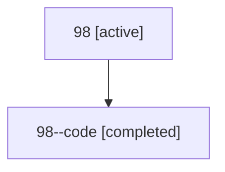

# Family: 98

[Agent Hoods](../README.md) / [bbugyi200](../users/bbugyi200/README.md) / [athena](../users/bbugyi200/machines/athena/README.md) / [98](../users/bbugyi200/machines/athena/hoods/98/README.md) / 98

Owner: `bbugyi200.athena` · Hood: `98` · Members: 2

## Lineage

The diagram is an optional enhancement; the ordered table below contains the same lineage in accessible text.

| Role | Agent | State | Model / provider | Timing | Commits | Prompt | Chat |
|---|---|---|---|---|---:|---|---|
| root | 98 | active | gpt-5.6-sol / codex | 2026-07-15T15:38:31.869559+00:00 | 0 | [Prompt](../agents/bbugyi200.athena.98/prompt.md) | [Chat](../agents/bbugyi200.athena.98/chat.md) |
| code | 98--code | completed | gpt-5.6-sol / codex | 2026-07-15T15:42:24.893473+00:00 | 0 | — | [Chat](../agents/bbugyi200.athena.98--code/chat.md) |

## Commits

| Role | Repo | Commit | Subject | Committed |
|---|---|---|---|---|
| — | sase | [`3053fa7`](https://github.com/sase-org/sase/commit/3053fa78f995ccccb3f92c92337fe4fee0cc8d20) | chore: Add SDD prompt and plan for remove\_shift\_enter\_prompt\_stack | 2026-06-17 11:24:39 UTC |
| — | sase | [`b017a62`](https://github.com/sase-org/sase/commit/b017a6207188cd84cbc44cfb350e0ca8055095dc) | feat(ace)!: remove Shift+Enter prompt-stack submit alias | 2026-06-17 11:36:21 UTC |
