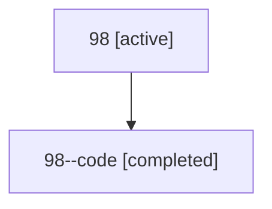

# Family: 98

Owner: `bbugyi200.athena` · Hood: `98` · Members: 2

## Lineage

The diagram is an optional enhancement; the ordered table below contains the same lineage in accessible text.

| Role | Agent | State | Model / provider | Timing | Commits | Prompt | Chat |
|---|---|---|---|---|---:|---|---|
| root | 98 | active | gpt-5.6-sol / codex | 2026-07-15T15:38:31.869559+00:00 | 2 | [Prompt](../agents/bbugyi200.athena.98/prompt.md) | [Chat](../agents/bbugyi200.athena.98/chat.md) |
| code | 98--code | completed | gpt-5.6-sol / codex | 2026-07-15T15:42:24.893473+00:00 | 0 | — | [Chat](../agents/bbugyi200.athena.98--code/chat.md) |
