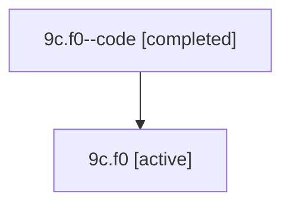

# Family: 9c.f0

[Agent Hoods](../README.md) / [bbugyi200](../users/bbugyi200/README.md) / [athena](../users/bbugyi200/machines/athena/README.md) / [9c](../users/bbugyi200/machines/athena/hoods/9c/README.md) / 9c.f0

Owner: `bbugyi200.athena` · Hood: `9c` · Members: 2

## Lineage

The diagram is an optional enhancement; the ordered table below contains the same lineage in accessible text.

| Role | Agent | State | Model / provider | Timing | Commits | Prompt | Chat |
|---|---|---|---|---|---:|---|---|
| code | 9c.f0--code | completed | gpt-5.6-sol / codex | 2026-07-15T17:47:03.932171+00:00 | 0 | — | [Chat](../agents/bbugyi200.athena.9c.f0--code/chat.md) |
| root | 9c.f0 | active | gpt-5.6-sol / codex | 2026-07-15T17:33:46.292558+00:00 | 0 | [Prompt](../agents/bbugyi200.athena.9c.f0/prompt.md) | [Chat](../agents/bbugyi200.athena.9c.f0/chat.md) |

## Neighbors

| Agent | Relation | State |
|---|---|---|
| [9c](bbugyi200.athena.9c.md) (family · 2) | ancestor | active 1, completed 1 |
