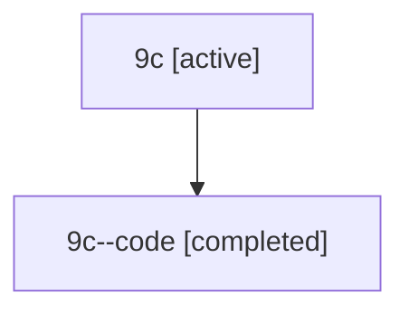

# Family: 9c

[Agent Hoods](../README.md) / [bbugyi200](../users/bbugyi200/README.md) / [athena](../users/bbugyi200/machines/athena/README.md) / [9c](../users/bbugyi200/machines/athena/hoods/9c/README.md) / 9c

Owner: `bbugyi200.athena` · Hood: `9c` · Members: 2

## Lineage

The diagram is an optional enhancement; the ordered table below contains the same lineage in accessible text.

| Role | Agent | State | Model / provider | Timing | Commits | Prompt | Chat |
|---|---|---|---|---|---:|---|---|
| root | 9c | active | gpt-5.6-sol / codex | 2026-07-15T16:53:52.438580+00:00 | [3](../agents/bbugyi200.athena.9c/README.md#commits) | [Prompt](../agents/bbugyi200.athena.9c/prompt.md) | [Chat](../agents/bbugyi200.athena.9c/chat.md) |
| code | 9c--code | completed | gpt-5.6-sol / codex | 2026-07-15T17:04:08.281430+00:00 | [1](../agents/bbugyi200.athena.9c--code/README.md#commits) | — | [Chat](../agents/bbugyi200.athena.9c--code/chat.md) |

## Commits

| Role | Repo | Commit | Subject | Committed (UTC) |
|---|---|---|---|---|
| root | sase | [`29d7793`](https://github.com/sase-org/sase/commit/29d7793c3d4172ddc58753faa1471c4454ca6a9e) | chore: Add SDD prompt and plan for ace\_tui\_fetch\_png\_diff\_crash | 2026-06-17 12:12:15 |
| root | sase | [`d4f25bc`](https://github.com/sase-org/sase/commit/d4f25bcc1bd340ba8c24f05dfdd1f8ab92c9c043) | fix(tui): stop treating path-typed workflow outputs as diffs | 2026-06-17 12:28:25 |
| code | sase | [`0a124f7`](https://github.com/sase-org/sase/commit/0a124f74492e310a7abea7a8828f2d4e0d01864e) | fix: release runner slots while awaiting answers | 2026-07-15 17:32:49 |
| root | sase | [`0a124f7`](https://github.com/sase-org/sase/commit/0a124f74492e310a7abea7a8828f2d4e0d01864e) | fix: release runner slots while awaiting answers | 2026-07-15 17:32:49 |

## Neighbors

| Agent | Relation | State |
|---|---|---|
| [9c.f0](bbugyi200.athena.9c.f0.md) (family · 2) | descendant | active 1, completed 1 |
