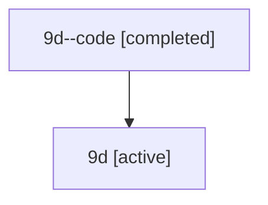

# Family: 9d

Owner: `bbugyi200.athena` · Hood: `9d` · Members: 2

## Lineage

The diagram is an optional enhancement; the ordered table below contains the same lineage in accessible text.

| Role | Agent | State | Model / provider | Timing | Commits | Prompt | Chat |
|---|---|---|---|---|---:|---|---|
| code | 9d--code | completed | gpt-5.6-sol / codex | 2026-07-15T17:21:52.197514+00:00 | 0 | — | [Chat](../agents/bbugyi200.athena.9d--code/chat.md) |
| root | 9d | active | claude-fable-5 / claude | 2026-07-15T16:58:02.817662+00:00 | 1 | [Prompt](../agents/bbugyi200.athena.9d/prompt.md) | [Chat](../agents/bbugyi200.athena.9d/chat.md) |
