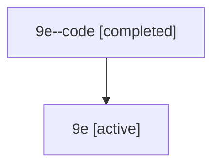

# Family: 9e

[Agent Hoods](../README.md) / [bbugyi200](../users/bbugyi200/README.md) / [athena](../users/bbugyi200/machines/athena/README.md) / [9e](../users/bbugyi200/machines/athena/hoods/9e/README.md) / 9e

Owner: `bbugyi200.athena` · Hood: `9e` · Members: 2

## Lineage

The diagram is an optional enhancement; the ordered table below contains the same lineage in accessible text.

| Role | Agent | State | Model / provider | Timing | Commits | Prompt | Chat |
|---|---|---|---|---|---:|---|---|
| code | 9e--code | completed | gpt-5.6-sol / codex | 2026-07-15T17:37:37.826876+00:00 | 0 | — | [Chat](../agents/bbugyi200.athena.9e--code/chat.md) |
| root | 9e | active | gpt-5.6-sol / codex | 2026-07-15T17:29:46.173792+00:00 | 0 | [Prompt](../agents/bbugyi200.athena.9e/prompt.md) | [Chat](../agents/bbugyi200.athena.9e/chat.md) |

## Commits

| Role | Repo | Commit | Subject | Committed |
|---|---|---|---|---|
| — | sase | [`f26c178`](https://github.com/sase-org/sase/commit/f26c178353d33a07cb97351cad7c5e4c956ab8f0) | chore: Add SDD prompt and plan for prompt\_stack\_ctrl\_shift\_navigation | 2026-06-17 09:42:46 EDT |
| — | sase | [`770f4e9`](https://github.com/sase-org/sase/commit/770f4e9e08ed722a09b4f742ea2abda833f1925b) | feat(tui): migrate prompt stack pane navigation to Ctrl+Shift+J/K | 2026-06-17 09:52:35 EDT |

## Neighbors

| Agent | Relation | State |
|---|---|---|
| [9e.f1](../agents/bbugyi200.athena.9e.f1/README.md) | descendant | completed |
| [9e.f1.f1](../agents/bbugyi200.athena.9e.f1.f1/README.md) | descendant | completed |
| [9e.f1.f1.f1](../agents/bbugyi200.athena.9e.f1.f1.f1/README.md) | descendant | completed |
| [9e.f1.f1.f1.f1](../agents/bbugyi200.athena.9e.f1.f1.f1.f1/README.md) | descendant | completed |
| [9e.f1.f2](../agents/bbugyi200.athena.9e.f1.f2/README.md) | descendant | completed |
| [9e.f1.f2.f1](../agents/bbugyi200.athena.9e.f1.f2.f1/README.md) | descendant | completed |
| [9e.f1.f2.f1.f1](../agents/bbugyi200.athena.9e.f1.f2.f1.f1/README.md) | descendant | completed |
| [9e.f1.f2.w1](../agents/bbugyi200.athena.9e.f1.f2.w1/README.md) | descendant | completed |
