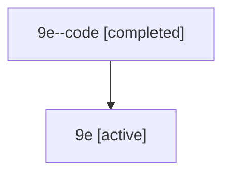

# Family: 9e

Owner: `bbugyi200.athena` · Hood: `9e` · Members: 2

## Lineage

The diagram is an optional enhancement; the ordered table below contains the same lineage in accessible text.

| Role | Agent | State | Model / provider | Timing | Commits | Prompt | Chat |
|---|---|---|---|---|---:|---|---|
| code | 9e--code | completed | gpt-5.6-sol / codex | 2026-07-15T17:37:37.826876+00:00 | 0 | — | [Chat](../agents/bbugyi200.athena.9e--code/chat.md) |
| root | 9e | active | gpt-5.6-sol / codex | 2026-07-15T17:29:46.173792+00:00 | 2 | [Prompt](../agents/bbugyi200.athena.9e/prompt.md) | [Chat](../agents/bbugyi200.athena.9e/chat.md) |
