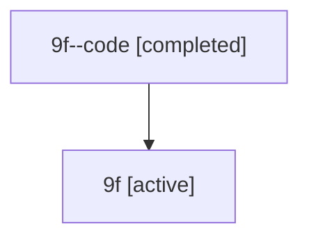

# Family: 9f

[Agent Hoods](../README.md) / [bbugyi200](../users/bbugyi200/README.md) / [athena](../users/bbugyi200/machines/athena/README.md) / [9f](../users/bbugyi200/machines/athena/hoods/9f/README.md) / 9f

Owner: `bbugyi200.athena` · Hood: `9f` · Members: 2

## Lineage

The diagram is an optional enhancement; the ordered table below contains the same lineage in accessible text.

| Role | Agent | State | Model / provider | Timing | Commits | Prompt | Chat |
|---|---|---|---|---|---:|---|---|
| code | 9f--code | completed | gpt-5.6-sol / codex | 2026-07-15T17:47:32.115677+00:00 | [1](../agents/bbugyi200.athena.9f--code/README.md#commits) | — | [Chat](../agents/bbugyi200.athena.9f--code/chat.md) |
| root | 9f | active | gpt-5.6-sol / codex | 2026-07-15T17:31:26.794327+00:00 | [3](../agents/bbugyi200.athena.9f/README.md#commits) | [Prompt](../agents/bbugyi200.athena.9f/prompt.md) | [Chat](../agents/bbugyi200.athena.9f/chat.md) |

## Commits

| Role | Commit | Subject | Committed (UTC) |
|---|---|---|---|
| root | [`1607d60`](https://github.com/sase-org/sase/commit/1607d601eea797aa741dac2cf771a7dddd694af2) | chore: Add SDD prompt and plan for xprompt\_part\_color | 2026-06-17 14:24:01 |
| root | [`7531efc`](https://github.com/sase-org/sase/commit/7531efcc4df00dcfc1c5e25f09634afbdbf46fdb) | feat(tui): use distinct color for xprompt part values | 2026-06-17 14:30:55 |
| code | [`805de8f`](https://github.com/sase-org/sase/commit/805de8fe66844508303575aa6c4975c1b2a0588e) | test: harden CI reliability harnesses | 2026-07-15 18:13:42 |
| root | [`805de8f`](https://github.com/sase-org/sase/commit/805de8fe66844508303575aa6c4975c1b2a0588e) | test: harden CI reliability harnesses | 2026-07-15 18:13:42 |
