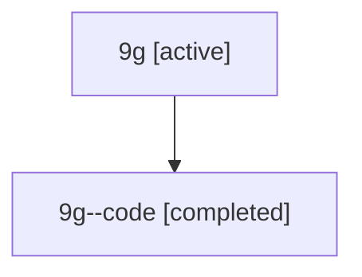

# Family: 9g

[Agent Hoods](../README.md) / [bbugyi200](../users/bbugyi200/README.md) / [athena](../users/bbugyi200/machines/athena/README.md) / [9g](../users/bbugyi200/machines/athena/hoods/9g/README.md) / 9g

Owner: `bbugyi200.athena` · Hood: `9g` · Members: 2

## Lineage

The diagram is an optional enhancement; the ordered table below contains the same lineage in accessible text.

| Role | Agent | State | Model / provider | Timing | Commits | Prompt | Chat |
|---|---|---|---|---|---:|---|---|
| root | 9g | active | gpt-5.6-sol / codex | 2026-07-15T17:33:43.894173+00:00 | [1](../agents/bbugyi200.athena.9g/README.md#commits) | [Prompt](../agents/bbugyi200.athena.9g/prompt.md) | [Chat](../agents/bbugyi200.athena.9g/chat.md) |
| code | 9g--code | completed | gpt-5.6-sol / codex | 2026-07-15T17:48:15.994525+00:00 | [1](../agents/bbugyi200.athena.9g--code/README.md#commits) | — | [Chat](../agents/bbugyi200.athena.9g--code/chat.md) |

## Commits

| Role | Repo | Commit | Subject | Committed |
|---|---|---|---|---|
| code | sase | [`73c2dc6`](https://github.com/sase-org/sase/commit/73c2dc6db11abcad2cc0402e85b9774a7c523101) | fix: preserve command output tails in tool reports | 2026-07-15 14:09:29 EDT |
| root | sase | [`73c2dc6`](https://github.com/sase-org/sase/commit/73c2dc6db11abcad2cc0402e85b9774a7c523101) | fix: preserve command output tails in tool reports | 2026-07-15 14:09:29 EDT |

## Neighbors

| Agent | Relation | State |
|---|---|---|
| [9g.cld](../agents/bbugyi200.athena.9g.cld/README.md) | descendant | completed |
