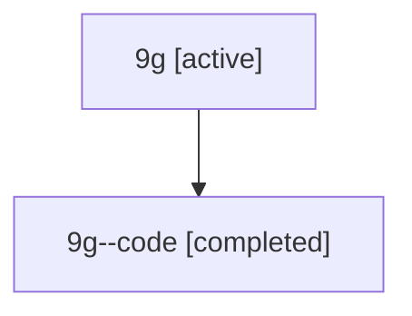

# Family: 9g

Owner: `bbugyi200.athena` · Hood: `9g` · Members: 2

## Lineage

The diagram is an optional enhancement; the ordered table below contains the same lineage in accessible text.

| Role | Agent | State | Model / provider | Timing | Commits | Prompt | Chat |
|---|---|---|---|---|---:|---|---|
| root | 9g | active | gpt-5.6-sol / codex | 2026-07-15T17:33:43.894173+00:00 | 1 | [Prompt](../agents/bbugyi200.athena.9g/prompt.md) | [Chat](../agents/bbugyi200.athena.9g/chat.md) |
| code | 9g--code | completed | gpt-5.6-sol / codex | 2026-07-15T17:48:15.994525+00:00 | 1 | — | [Chat](../agents/bbugyi200.athena.9g--code/chat.md) |
