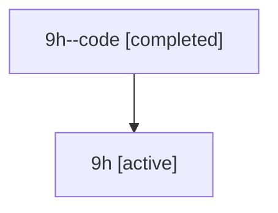

# Family: 9h

[Agent Hoods](../README.md) / [bbugyi200](../users/bbugyi200/README.md) / [athena](../users/bbugyi200/machines/athena/README.md) / [9h](../users/bbugyi200/machines/athena/hoods/9h/README.md) / 9h

Owner: `bbugyi200.athena` · Hood: `9h` · Members: 2

## Lineage

The diagram is an optional enhancement; the ordered table below contains the same lineage in accessible text.

| Role | Agent | State | Model / provider | Timing | Commits | Prompt | Chat |
|---|---|---|---|---|---:|---|---|
| code | 9h--code | completed | gpt-5.6-sol / codex | 2026-07-15T17:46:52.897513+00:00 | [1](../agents/bbugyi200.athena.9h--code/README.md#commits) | — | [Chat](../agents/bbugyi200.athena.9h--code/chat.md) |
| root | 9h | active | gpt-5.6-sol / codex | 2026-07-15T17:36:27.587104+00:00 | 0 | [Prompt](../agents/bbugyi200.athena.9h/prompt.md) | [Chat](../agents/bbugyi200.athena.9h/chat.md) |

## Commits

| Role | Repo | Commit | Subject | Committed |
|---|---|---|---|---|
| code | sase | [`add1577`](https://github.com/sase-org/sase/commit/add1577de51e02459bdb3ba67a72ca69207210da) | fix(update): upgrade core wheel with editable sources | 2026-07-15 18:18:21 UTC |

## Neighbors

| Agent | Relation | State |
|---|---|---|
| [9h.cld](../agents/bbugyi200.athena.9h.cld/README.md) | descendant | completed |
