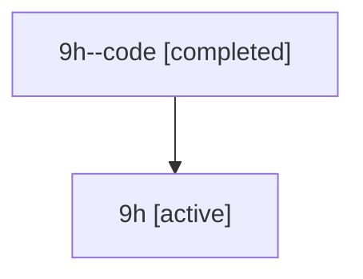

# Family: 9h

Owner: `bbugyi200.athena` · Hood: `9h` · Members: 2

## Lineage

The diagram is an optional enhancement; the ordered table below contains the same lineage in accessible text.

| Role | Agent | State | Model / provider | Timing | Commits | Prompt | Chat |
|---|---|---|---|---|---:|---|---|
| code | 9h--code | completed | gpt-5.6-sol / codex | 2026-07-15T17:46:52.897513+00:00 | 1 | — | [Chat](../agents/bbugyi200.athena.9h--code/chat.md) |
| root | 9h | active | gpt-5.6-sol / codex | 2026-07-15T17:36:27.587104+00:00 | 1 | [Prompt](../agents/bbugyi200.athena.9h/prompt.md) | [Chat](../agents/bbugyi200.athena.9h/chat.md) |
