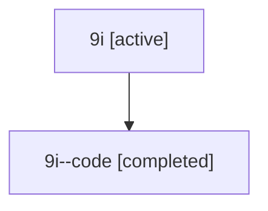

# Family: 9i

Owner: `bbugyi200.athena` · Hood: `9i` · Members: 2

## Lineage

The diagram is an optional enhancement; the ordered table below contains the same lineage in accessible text.

| Role | Agent | State | Model / provider | Timing | Commits | Prompt | Chat |
|---|---|---|---|---|---:|---|---|
| root | 9i | active | gpt-5.6-sol / codex | 2026-07-15T17:45:10.170356+00:00 | 1 | [Prompt](../agents/bbugyi200.athena.9i/prompt.md) | [Chat](../agents/bbugyi200.athena.9i/chat.md) |
| code | 9i--code | completed | gpt-5.6-sol / codex | 2026-07-15T17:52:55.419462+00:00 | 0 | — | [Chat](../agents/bbugyi200.athena.9i--code/chat.md) |
