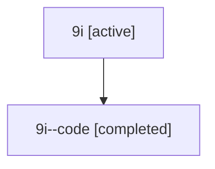

# Family: 9i

[Agent Hoods](../README.md) / [bbugyi200](../users/bbugyi200/README.md) / [athena](../users/bbugyi200/machines/athena/README.md) / [9i](../users/bbugyi200/machines/athena/hoods/9i/README.md) / 9i

Owner: `bbugyi200.athena` · Hood: `9i` · Members: 2

## Lineage

The diagram is an optional enhancement; the ordered table below contains the same lineage in accessible text.

| Role | Agent | State | Model / provider | Timing | Commits | Prompt | Chat |
|---|---|---|---|---|---:|---|---|
| root | 9i | active | gpt-5.6-sol / codex | 2026-07-15T17:45:10.170356+00:00 | 0 | [Prompt](../agents/bbugyi200.athena.9i/prompt.md) | [Chat](../agents/bbugyi200.athena.9i/chat.md) |
| code | 9i--code | completed | gpt-5.6-sol / codex | 2026-07-15T17:52:55.419462+00:00 | [1](../agents/bbugyi200.athena.9i--code/README.md#commits) | — | [Chat](../agents/bbugyi200.athena.9i--code/chat.md) |

## Commits

| Role | Repo | Commit | Subject | Committed |
|---|---|---|---|---|
| code | sase | [`75bf5c7`](https://github.com/sase-org/sase/commit/75bf5c791c302823415a4efa4b277740fc7e79ff) | feat(ace): show associated plan metadata | 2026-07-15 18:35:43 UTC |

## Neighbors

| Agent | Relation | State |
|---|---|---|
| [9i.f0](../agents/bbugyi200.athena.9i.f0/README.md) | descendant | waiting |
| [9i.f1](bbugyi200.athena.9i.f1.md) (family · 2) | descendant | active 1, completed 1 |
