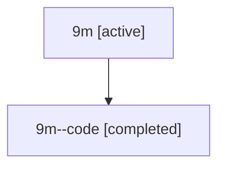

# Family: 9m

Owner: `bbugyi200.athena` · Hood: `9m` · Members: 2

## Lineage

The diagram is an optional enhancement; the ordered table below contains the same lineage in accessible text.

| Role | Agent | State | Model / provider | Timing | Commits | Prompt | Chat |
|---|---|---|---|---|---:|---|---|
| root | 9m | active | claude-fable-5 / claude | 2026-07-15T18:07:29.361224+00:00 | 3 | [Prompt](../agents/bbugyi200.athena.9m/prompt.md) | [Chat](../agents/bbugyi200.athena.9m/chat.md) |
| code | 9m--code | completed | gpt-5.6-sol / codex | 2026-07-15T18:33:52.161305+00:00 | 0 | — | [Chat](../agents/bbugyi200.athena.9m--code/chat.md) |
