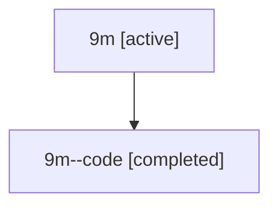

# Family: 9m

[Agent Hoods](../README.md) / [bbugyi200](../users/bbugyi200/README.md) / [athena](../users/bbugyi200/machines/athena/README.md) / [9m](../users/bbugyi200/machines/athena/hoods/9m/README.md) / 9m

Owner: `bbugyi200.athena` · Hood: `9m` · Members: 2

## Lineage

The diagram is an optional enhancement; the ordered table below contains the same lineage in accessible text.

| Role | Agent | State | Model / provider | Timing | Commits | Prompt | Chat |
|---|---|---|---|---|---:|---|---|
| root | 9m | active | claude-fable-5 / claude | 2026-07-15T18:07:29.361224+00:00 | 0 | [Prompt](../agents/bbugyi200.athena.9m/prompt.md) | [Chat](../agents/bbugyi200.athena.9m/chat.md) |
| code | 9m--code | completed | gpt-5.6-sol / codex | 2026-07-15T18:33:52.161305+00:00 | [1](../agents/bbugyi200.athena.9m--code/README.md#commits) | — | [Chat](../agents/bbugyi200.athena.9m--code/chat.md) |

## Commits

| Role | Repo | Commit | Subject | Committed |
|---|---|---|---|---|
| — | sase | [`2a4312a`](https://github.com/sase-org/sase/commit/2a4312a00c0583a6de35fe2dd4de6b40920d8ec9) | chore: Add SDD prompt and plan for prompt\_leader\_hints | 2026-06-17 15:48:55 UTC |
| — | sase | [`1eef9c3`](https://github.com/sase-org/sase/commit/1eef9c39cc957c31c7742e66ca0d10473ae54a74) | feat(tui): show prompt comma-leader hints | 2026-06-17 16:08:20 UTC |
| code | sase | [`cb9deb0`](https://github.com/sase-org/sase/commit/cb9deb06929189178ba2953c13364360f7111991) | fix: guard remote SDD creation and plan routing | 2026-07-15 18:57:15 UTC |
