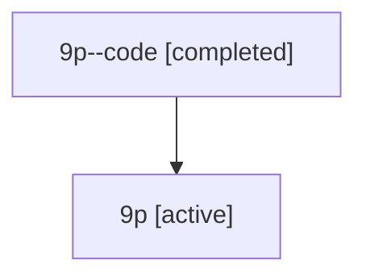

# Family: 9p

Owner: `bbugyi200.athena` · Hood: `9p` · Members: 2

## Lineage

The diagram is an optional enhancement; the ordered table below contains the same lineage in accessible text.

| Role | Agent | State | Model / provider | Timing | Commits | Prompt | Chat |
|---|---|---|---|---|---:|---|---|
| code | 9p--code | completed | gpt-5.6-sol / codex | 2026-07-15T19:46:13.928127+00:00 | 1 | — | [Chat](../agents/bbugyi200.athena.9p--code/chat.md) |
| root | 9p | active | gpt-5.6-sol / codex | 2026-07-15T19:40:15.017163+00:00 | 3 | [Prompt](../agents/bbugyi200.athena.9p/prompt.md) | [Chat](../agents/bbugyi200.athena.9p/chat.md) |
