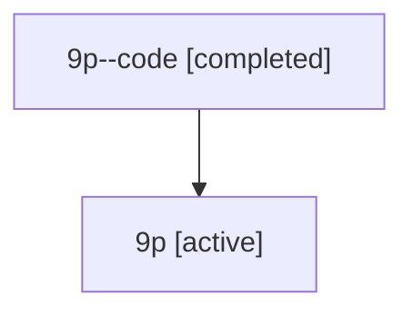

# Family: 9p

[Agent Hoods](../README.md) / [bbugyi200](../users/bbugyi200/README.md) / [athena](../users/bbugyi200/machines/athena/README.md) / [9p](../users/bbugyi200/machines/athena/hoods/9p/README.md) / 9p

Owner: `bbugyi200.athena` · Hood: `9p` · Members: 2

## Lineage

The diagram is an optional enhancement; the ordered table below contains the same lineage in accessible text.

| Role | Agent | State | Model / provider | Timing | Commits | Prompt | Chat |
|---|---|---|---|---|---:|---|---|
| code | 9p--code | completed | gpt-5.6-sol / codex | 2026-07-15T19:46:13.928127+00:00 | [1](../agents/bbugyi200.athena.9p--code/README.md#commits) | — | [Chat](../agents/bbugyi200.athena.9p--code/chat.md) |
| root | 9p | active | gpt-5.6-sol / codex | 2026-07-15T19:40:15.017163+00:00 | 0 | [Prompt](../agents/bbugyi200.athena.9p/prompt.md) | [Chat](../agents/bbugyi200.athena.9p/chat.md) |

## Commits

| Role | Repo | Commit | Subject | Committed |
|---|---|---|---|---|
| — | sase | [`c3cf8bb`](https://github.com/sase-org/sase/commit/c3cf8bbb73539eabf78e90dab83c6a23fd9d5eb5) | chore: Add SDD prompt and plan for prompt\_editor\_spacing | 2026-06-17 17:20:16 UTC |
| — | sase | [`831e358`](https://github.com/sase-org/sase/commit/831e358c3e69ae552aa3bcb9cd08c07819421c38) | feat(tui): add spaced editor markdown for prompt stack \<ctrl+g\> | 2026-06-17 17:27:52 UTC |
| code | sase | [`f5d7184`](https://github.com/sase-org/sase/commit/f5d718444ae0a67ef92791014a33e419994210ed) | fix(xprompt): render declared inputs inside inline code | 2026-07-15 19:58:29 UTC |

## Neighbors

| Agent | Relation | State |
|---|---|---|
| [9p.f0](bbugyi200.athena.9p.f0.md) (family · 2) | descendant | active 1, completed 1 |
