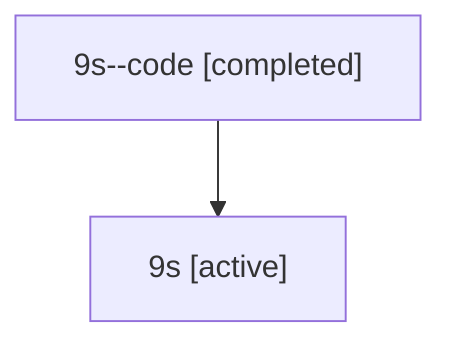

# Family: 9s

[Agent Hoods](../README.md) / [bbugyi200](../users/bbugyi200/README.md) / [athena](../users/bbugyi200/machines/athena/README.md) / [9s](../users/bbugyi200/machines/athena/hoods/9s/README.md) / 9s

Owner: `bbugyi200.athena` · Hood: `9s` · Members: 2

## Lineage

The diagram is an optional enhancement; the ordered table below contains the same lineage in accessible text.

| Role | Agent | State | Model / provider | Timing | Commits | Prompt | Chat |
|---|---|---|---|---|---:|---|---|
| code | 9s--code | completed | gpt-5.6-sol / codex | 2026-07-15T21:04:15.348041+00:00 | 0 | — | [Chat](../agents/bbugyi200.athena.9s--code/chat.md) |
| root | 9s | active | gpt-5.6-sol / codex | 2026-07-15T20:52:06.148739+00:00 | [1](../agents/bbugyi200.athena.9s/README.md#commits) | [Prompt](../agents/bbugyi200.athena.9s/prompt.md) | [Chat](../agents/bbugyi200.athena.9s/chat.md) |

## Commits

| Role | Repo | Commit | Subject | Committed (UTC) |
|---|---|---|---|---|
| root | sase | [`3362655`](https://github.com/sase-org/sase/commit/33626551f485a0dd65ecf0c37626eab7f9ea2259) | fix: resolve epic launches from canonical project identity | 2026-07-15 21:15:52 |
