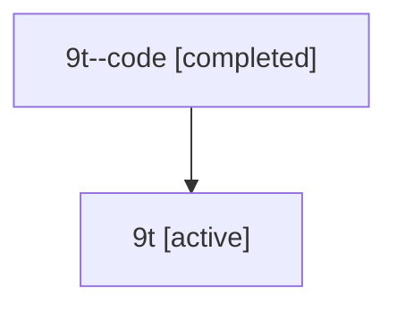

# Family: 9t

[Agent Hoods](../README.md) / [bbugyi200](../users/bbugyi200/README.md) / [athena](../users/bbugyi200/machines/athena/README.md) / [9t](../users/bbugyi200/machines/athena/hoods/9t/README.md) / 9t

Owner: `bbugyi200.athena` · Hood: `9t` · Members: 2

## Lineage

The diagram is an optional enhancement; the ordered table below contains the same lineage in accessible text.

| Role | Agent | State | Model / provider | Timing | Commits | Prompt | Chat |
|---|---|---|---|---|---:|---|---|
| code | 9t--code | completed | gpt-5.6-sol / codex | 2026-07-15T22:03:46.844064+00:00 | [1](../agents/bbugyi200.athena.9t--code/README.md#commits) | — | [Chat](../agents/bbugyi200.athena.9t--code/chat.md) |
| root | 9t | active | gpt-5.6-sol / codex | 2026-07-15T22:00:11.843647+00:00 | 0 | [Prompt](../agents/bbugyi200.athena.9t/prompt.md) | [Chat](../agents/bbugyi200.athena.9t/chat.md) |

## Commits

| Role | Repo | Commit | Subject | Committed |
|---|---|---|---|---|
| code | sase | [`ede79bc`](https://github.com/sase-org/sase/commit/ede79bc989570e82fe5ed8da00f425b8e924e48d) | fix(ace): compact SASE plan heading | 2026-07-15 18:12:20 EDT |

## Neighbors

| Agent | Relation | State |
|---|---|---|
| [9t.cdx](../agents/bbugyi200.athena.9t.cdx/README.md) | descendant | completed |
