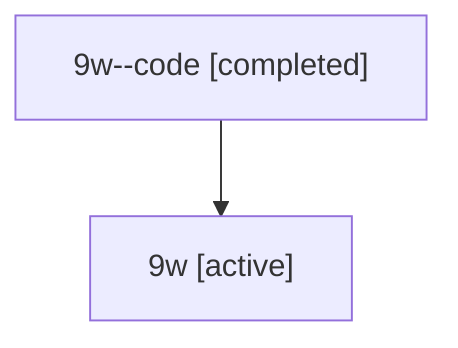

# Family: 9w

[Agent Hoods](../README.md) / [bbugyi200](../users/bbugyi200/README.md) / [athena](../users/bbugyi200/machines/athena/README.md) / [9w](../users/bbugyi200/machines/athena/hoods/9w/README.md) / 9w

Owner: `bbugyi200.athena` · Hood: `9w` · Members: 2

## Lineage

The diagram is an optional enhancement; the ordered table below contains the same lineage in accessible text.

| Role | Agent | State | Model / provider | Timing | Commits | Prompt | Chat |
|---|---|---|---|---|---:|---|---|
| code | 9w--code | completed | gpt-5.6-sol / codex | 2026-07-15T22:29:41.636211+00:00 | 0 | — | [Chat](../agents/bbugyi200.athena.9w--code/chat.md) |
| root | 9w | active | gpt-5.6-sol / codex | 2026-07-15T22:23:35.083592+00:00 | [3](../agents/bbugyi200.athena.9w/README.md#commits) | [Prompt](../agents/bbugyi200.athena.9w/prompt.md) | [Chat](../agents/bbugyi200.athena.9w/chat.md) |

## Commits

| Role | Repo | Commit | Subject | Committed (UTC) |
|---|---|---|---|---|
| root | sase | [`98ed259`](https://github.com/sase-org/sase/commit/98ed259ec6ac16ce916fe5af55412b92c1904d74) | chore: Add SDD prompt and plan for telegram\_plan\_reject\_kill | 2026-06-17 21:49:24 |
| root | sase | [`29a6748`](https://github.com/sase-org/sase/commit/29a67484594ef39229962a502650f2c813d3fb1e) | chore: Mark SDD plan done | 2026-06-17 22:13:53 |
| root | sase | [`728595e`](https://github.com/sase-org/sase/commit/728595e54ae517b2befb140dca7d5b29e8be2934) | fix(tui): compact agent metadata sections | 2026-07-15 22:50:48 |
