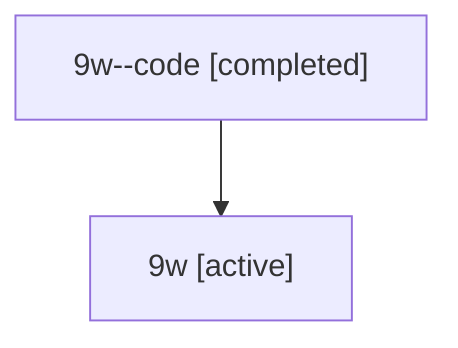

# Family: 9w

Owner: `bbugyi200.athena` · Hood: `9w` · Members: 2

## Lineage

The diagram is an optional enhancement; the ordered table below contains the same lineage in accessible text.

| Role | Agent | State | Model / provider | Timing | Commits | Prompt | Chat |
|---|---|---|---|---|---:|---|---|
| code | 9w--code | completed | gpt-5.6-sol / codex | 2026-07-15T22:29:41.636211+00:00 | 1 | — | [Chat](../agents/bbugyi200.athena.9w--code/chat.md) |
| root | 9w | active | gpt-5.6-sol / codex | 2026-07-15T22:23:35.083592+00:00 | 3 | [Prompt](../agents/bbugyi200.athena.9w/prompt.md) | [Chat](../agents/bbugyi200.athena.9w/chat.md) |
