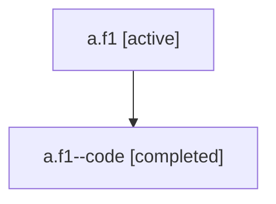

# Family: a.f1

[Agent Hoods](../README.md) / [bbugyi200](../users/bbugyi200/README.md) / [athena](../users/bbugyi200/machines/athena/README.md) / [a](../users/bbugyi200/machines/athena/hoods/a/README.md) / a.f1

Owner: `bbugyi200.athena` · Hood: `a` · Members: 2

## Lineage

The diagram is an optional enhancement; the ordered table below contains the same lineage in accessible text.

| Role | Agent | State | Model / provider | Timing | Commits | Prompt | Chat |
|---|---|---|---|---|---:|---|---|
| root | a.f1 | active | claude-fable-5 / claude | 2026-07-06T18:23:14.447796+00:00 | [2](../agents/bbugyi200.athena.a.f1/README.md#commits) | [Prompt](../agents/bbugyi200.athena.a.f1/prompt.md) | [Chat](../agents/bbugyi200.athena.a.f1/chat.md) |
| code | a.f1--code | completed | gpt-5.5 / codex | 2026-07-06T18:44:19.279959+00:00 | [1](../agents/bbugyi200.athena.a.f1--code/README.md#commits) | — | [Chat](../agents/bbugyi200.athena.a.f1--code/chat.md) |

## Commits

| Role | Repo | Commit | Subject | Committed |
|---|---|---|---|---|
| root | sase | [`1468728`](https://github.com/sase-org/sase/commit/1468728b44435d4c401c1f25cf8fabc1dfb56da2) | chore: Add SDD prompt and plan for eradicate\_raw\_project\_keys | 2026-07-06 18:44:17 UTC |
| code | sase | [`4cce6a4`](https://github.com/sase-org/sase/commit/4cce6a46b099256a59048bae1539a13efc988063) | fix: humanize project-prefixed ChangeSpec names | 2026-07-06 19:21:44 UTC |
| root | sase | [`4cce6a4`](https://github.com/sase-org/sase/commit/4cce6a46b099256a59048bae1539a13efc988063) | fix: humanize project-prefixed ChangeSpec names | 2026-07-06 19:21:44 UTC |

## Neighbors

| Agent | Relation | State |
|---|---|---|
| [a](bbugyi200.athena.a.md) (family · 2) | ancestor | active 1, completed 1 |
