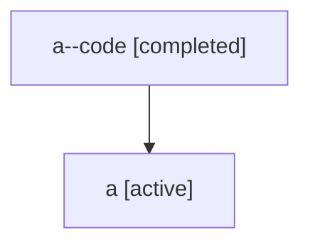

# Family: a

[Agent Hoods](../README.md) / [bbugyi200](../users/bbugyi200/README.md) / [athena](../users/bbugyi200/machines/athena/README.md) / [a](../users/bbugyi200/machines/athena/hoods/a/README.md) / a

Owner: `bbugyi200.athena` · Hood: `a` · Members: 2

## Lineage

The diagram is an optional enhancement; the ordered table below contains the same lineage in accessible text.

| Role | Agent | State | Model / provider | Timing | Commits | Prompt | Chat |
|---|---|---|---|---|---:|---|---|
| code | a--code | completed | gpt-5.5 / codex | 2026-07-06T17:13:56.176674+00:00 | [1](../agents/bbugyi200.athena.a--code/README.md#commits) | — | [Chat](../agents/bbugyi200.athena.a--code/chat.md) |
| root | a | active | claude-fable-5 / claude | 2026-07-06T17:00:21.588230+00:00 | 0 | [Prompt](../agents/bbugyi200.athena.a/prompt.md) | [Chat](../agents/bbugyi200.athena.a/chat.md) |

## Commits

| Role | Repo | Commit | Subject | Committed |
|---|---|---|---|---|
| code | sase | [`228fc78`](https://github.com/sase-org/sase/commit/228fc78aff339555268d16fee134d208f0991769) | fix(tui): humanize project refs in prompt displays | 2026-07-06 13:31:55 EDT |

## Neighbors

| Agent | Relation | State |
|---|---|---|
| [a.f1](bbugyi200.athena.a.f1.md) (family · 2) | descendant | active 1, completed 1 |
