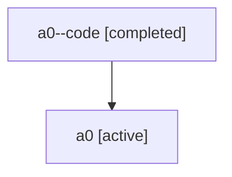

# Family: a0

[Agent Hoods](../README.md) / [bbugyi200](../users/bbugyi200/README.md) / [athena](../users/bbugyi200/machines/athena/README.md) / [a0](../users/bbugyi200/machines/athena/hoods/a0/README.md) / a0

Owner: `bbugyi200.athena` · Hood: `a0` · Members: 2

## Lineage

The diagram is an optional enhancement; the ordered table below contains the same lineage in accessible text.

| Role | Agent | State | Model / provider | Timing | Commits | Prompt | Chat |
|---|---|---|---|---|---:|---|---|
| code | a0--code | completed | gpt-5.6-sol / codex | 2026-07-15T23:12:14.633595+00:00 | [1](../agents/bbugyi200.athena.a0--code/README.md#commits) | — | [Chat](../agents/bbugyi200.athena.a0--code/chat.md) |
| root | a0 | active | gpt-5.6-sol / codex | 2026-07-15T23:01:54.016192+00:00 | [1](../agents/bbugyi200.athena.a0/README.md#commits) | [Prompt](../agents/bbugyi200.athena.a0/prompt.md) | [Chat](../agents/bbugyi200.athena.a0/chat.md) |

## Commits

| Role | Repo | Commit | Subject | Committed (UTC) |
|---|---|---|---|---|
| code | sase | [`d1a3bda`](https://github.com/sase-org/sase/commit/d1a3bdaf1d32b1a6b01e5605c1d603f09eef63da) | feat(ace): persist Agents fold state across sessions | 2026-07-15 23:43:52 |
| root | sase | [`d1a3bda`](https://github.com/sase-org/sase/commit/d1a3bdaf1d32b1a6b01e5605c1d603f09eef63da) | feat(ace): persist Agents fold state across sessions | 2026-07-15 23:43:52 |
