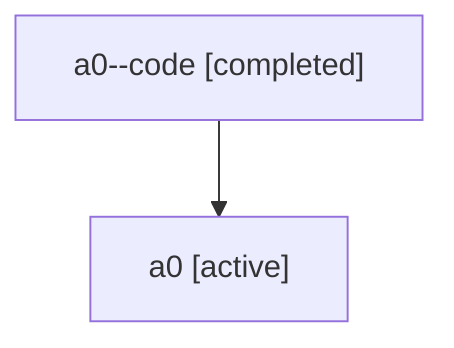

# Family: a0

Owner: `bbugyi200.athena` · Hood: `a0` · Members: 2

## Lineage

The diagram is an optional enhancement; the ordered table below contains the same lineage in accessible text.

| Role | Agent | State | Model / provider | Timing | Commits | Prompt | Chat |
|---|---|---|---|---|---:|---|---|
| code | a0--code | completed | gpt-5.6-sol / codex | 2026-07-15T23:12:14.633595+00:00 | 1 | — | [Chat](../agents/bbugyi200.athena.a0--code/chat.md) |
| root | a0 | active | gpt-5.6-sol / codex | 2026-07-15T23:01:54.016192+00:00 | 1 | [Prompt](../agents/bbugyi200.athena.a0/prompt.md) | [Chat](../agents/bbugyi200.athena.a0/chat.md) |
