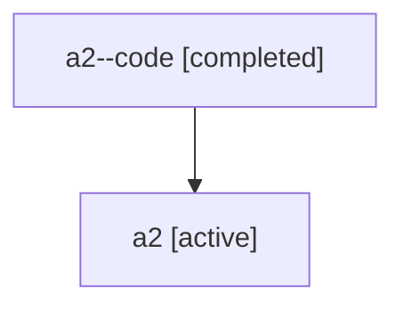

# Family: a2

Owner: `bbugyi200.athena` · Hood: `a2` · Members: 2

## Lineage

The diagram is an optional enhancement; the ordered table below contains the same lineage in accessible text.

| Role | Agent | State | Model / provider | Timing | Commits | Prompt | Chat |
|---|---|---|---|---|---:|---|---|
| code | a2--code | completed | gpt-5.6-sol / codex | 2026-07-16T00:39:15.037280+00:00 | 1 | — | [Chat](../agents/bbugyi200.athena.a2--code/chat.md) |
| root | a2 | active | gpt-5.6-sol / codex | 2026-07-16T00:33:58.724722+00:00 | 1 | [Prompt](../agents/bbugyi200.athena.a2/prompt.md) | [Chat](../agents/bbugyi200.athena.a2/chat.md) |
