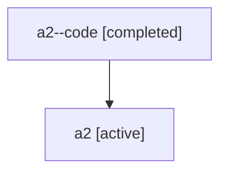

# Family: a2

[Agent Hoods](../README.md) / [bbugyi200](../users/bbugyi200/README.md) / [athena](../users/bbugyi200/machines/athena/README.md) / [a2](../users/bbugyi200/machines/athena/hoods/a2/README.md) / a2

Owner: `bbugyi200.athena` · Hood: `a2` · Members: 2

## Lineage

The diagram is an optional enhancement; the ordered table below contains the same lineage in accessible text.

| Role | Agent | State | Model / provider | Timing | Commits | Prompt | Chat |
|---|---|---|---|---|---:|---|---|
| code | a2--code | completed | gpt-5.6-sol / codex | 2026-07-16T00:39:15.037280+00:00 | [1](../agents/bbugyi200.athena.a2--code/README.md#commits) | — | [Chat](../agents/bbugyi200.athena.a2--code/chat.md) |
| root | a2 | active | gpt-5.6-sol / codex | 2026-07-16T00:33:58.724722+00:00 | [1](../agents/bbugyi200.athena.a2/README.md#commits) | [Prompt](../agents/bbugyi200.athena.a2/prompt.md) | [Chat](../agents/bbugyi200.athena.a2/chat.md) |

## Commits

| Role | Commit | Subject | Committed (UTC) |
|---|---|---|---|
| code | [`50ce11d`](https://github.com/sase-org/sase/commit/50ce11d988b443ccaf107f412bcb4e79d236a4d1) | fix(ace): show created status after epic launch | 2026-07-16 01:00:21 |
| root | [`50ce11d`](https://github.com/sase-org/sase/commit/50ce11d988b443ccaf107f412bcb4e79d236a4d1) | fix(ace): show created status after epic launch | 2026-07-16 01:00:21 |
