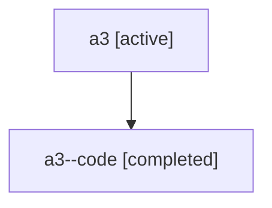

# Family: a3

[Agent Hoods](../README.md) / [bbugyi200](../users/bbugyi200/README.md) / [athena](../users/bbugyi200/machines/athena/README.md) / [a3](../users/bbugyi200/machines/athena/hoods/a3/README.md) / a3

Owner: `bbugyi200.athena` · Hood: `a3` · Members: 2

## Lineage

The diagram is an optional enhancement; the ordered table below contains the same lineage in accessible text.

| Role | Agent | State | Model / provider | Timing | Commits | Prompt | Chat |
|---|---|---|---|---|---:|---|---|
| root | a3 | active | gpt-5.6-sol / codex | 2026-07-16T10:29:45.990861+00:00 | [1](../agents/bbugyi200.athena.a3/README.md#commits) | [Prompt](../agents/bbugyi200.athena.a3/prompt.md) | [Chat](../agents/bbugyi200.athena.a3/chat.md) |
| code | a3--code | completed | gpt-5.6-sol / codex | 2026-07-16T10:33:28.140098+00:00 | 0 | — | [Chat](../agents/bbugyi200.athena.a3--code/chat.md) |

## Commits

| Role | Repo | Commit | Subject | Committed |
|---|---|---|---|---|
| root | sase | [`70d1fb5`](https://github.com/sase-org/sase/commit/70d1fb5668f0940bec221004e209e45a175bd0f6) | feat(tui): uppercase active nested tab labels | 2026-07-16 06:51:15 EDT |
