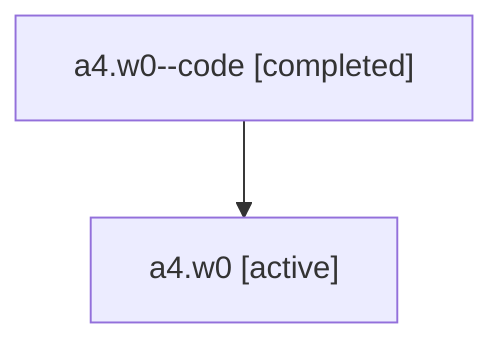

# Family: a4.w0

[Agent Hoods](../README.md) / [bbugyi200](../users/bbugyi200/README.md) / [athena](../users/bbugyi200/machines/athena/README.md) / [a4](../users/bbugyi200/machines/athena/hoods/a4/README.md) / a4.w0

Owner: `bbugyi200.athena` · Hood: `a4` · Members: 2

## Lineage

The diagram is an optional enhancement; the ordered table below contains the same lineage in accessible text.

| Role | Agent | State | Model / provider | Timing | Commits | Prompt | Chat |
|---|---|---|---|---|---:|---|---|
| code | a4.w0--code | completed | gpt-5.6-sol / codex | 2026-07-16T11:23:12.365258+00:00 | [1](../agents/bbugyi200.athena.a4.w0--code/README.md#commits) | — | [Chat](../agents/bbugyi200.athena.a4.w0--code/chat.md) |
| root | a4.w0 | active | gpt-5.6-sol / codex | 2026-07-16T11:18:52.299659+00:00 | 0 | [Prompt](../agents/bbugyi200.athena.a4.w0/prompt.md) | [Chat](../agents/bbugyi200.athena.a4.w0/chat.md) |

## Commits

| Role | Repo | Commit | Subject | Committed |
|---|---|---|---|---|
| code | sase | [`8ab0936`](https://github.com/sase-org/sase/commit/8ab0936f13cfa11e96e70385aeb587f12dbe12bf) | fix(ace): preserve explicit plan approval tiers | 2026-07-16 07:36:06 EDT |

## Neighbors

| Agent | Relation | State |
|---|---|---|
| [a4](bbugyi200.athena.a4.md) (family · 2) | ancestor | active 1, completed 1 |
| [a4.w0.w0](bbugyi200.athena.a4.w0.w0.md) (family · 2) | descendant | active 1, completed 1 |
| [a4.w0.w0.f0](bbugyi200.athena.a4.w0.w0.f0.md) (family · 2) | descendant | active 1, completed 1 |
| [a4.w0.w0.f1](bbugyi200.athena.a4.w0.w0.f1.md) (family · 2) | descendant | active 1, completed 1 |
| [a4.w0.w0.f1.f0](../agents/bbugyi200.athena.a4.w0.w0.f1.f0/README.md) | descendant | active |
