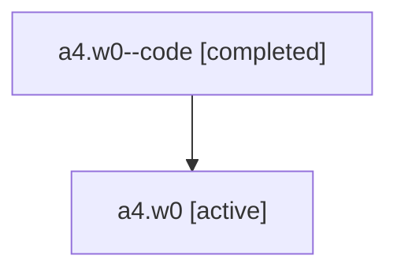

# Family: a4.w0

Owner: `bbugyi200.athena` · Hood: `a4` · Members: 2

## Lineage

The diagram is an optional enhancement; the ordered table below contains the same lineage in accessible text.

| Role | Agent | State | Model / provider | Timing | Commits | Prompt | Chat |
|---|---|---|---|---|---:|---|---|
| code | a4.w0--code | completed | gpt-5.6-sol / codex | 2026-07-16T11:23:12.365258+00:00 | 1 | — | [Chat](../agents/bbugyi200.athena.a4.w0--code/chat.md) |
| root | a4.w0 | active | gpt-5.6-sol / codex | 2026-07-16T11:18:52.299659+00:00 | 1 | [Prompt](../agents/bbugyi200.athena.a4.w0/prompt.md) | [Chat](../agents/bbugyi200.athena.a4.w0/chat.md) |
