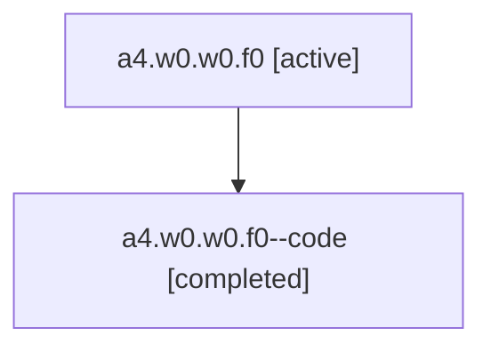

# Family: a4.w0.w0.f0

[Agent Hoods](../README.md) / [bbugyi200](../users/bbugyi200/README.md) / [athena](../users/bbugyi200/machines/athena/README.md) / [a4](../users/bbugyi200/machines/athena/hoods/a4/README.md) / a4.w0.w0.f0

Owner: `bbugyi200.athena` · Hood: `a4` · Members: 2

## Lineage

The diagram is an optional enhancement; the ordered table below contains the same lineage in accessible text.

| Role | Agent | State | Model / provider | Timing | Commits | Prompt | Chat |
|---|---|---|---|---|---:|---|---|
| root | a4.w0.w0.f0 | active | gpt-5.6-sol / codex | 2026-07-16T12:03:31.106431+00:00 | [1](../agents/bbugyi200.athena.a4.w0.w0.f0/README.md#commits) | [Prompt](../agents/bbugyi200.athena.a4.w0.w0.f0/prompt.md) | [Chat](../agents/bbugyi200.athena.a4.w0.w0.f0/chat.md) |
| code | a4.w0.w0.f0--code | completed | gpt-5.6-sol / codex | 2026-07-16T12:07:40.488004+00:00 | [1](../agents/bbugyi200.athena.a4.w0.w0.f0--code/README.md#commits) | — | [Chat](../agents/bbugyi200.athena.a4.w0.w0.f0--code/chat.md) |

## Commits

| Role | Repo | Commit | Subject | Committed |
|---|---|---|---|---|
| code | sase | [`d284ed1`](https://github.com/sase-org/sase/commit/d284ed1e593db3f1f2fae7d3163289b1d9b8df41) | feat(cli): show titles in plan inventory | 2026-07-16 08:19:17 EDT |
| root | sase | [`d284ed1`](https://github.com/sase-org/sase/commit/d284ed1e593db3f1f2fae7d3163289b1d9b8df41) | feat(cli): show titles in plan inventory | 2026-07-16 08:19:17 EDT |

## Neighbors

| Agent | Relation | State |
|---|---|---|
| [a4.w0.w0](bbugyi200.athena.a4.w0.w0.md) (family · 2) | ancestor | active 1, completed 1 |
| [a4.w0](bbugyi200.athena.a4.w0.md) (family · 2) | ancestor | active 1, completed 1 |
| [a4](bbugyi200.athena.a4.md) (family · 2) | ancestor | active 1, completed 1 |
| [a4.w0.w0.f1](bbugyi200.athena.a4.w0.w0.f1.md) (family · 2) | a4.w0.w0 hood | active 1, completed 1 |
| [a4.w0.w0.f1.f0](../agents/bbugyi200.athena.a4.w0.w0.f1.f0/README.md) | a4.w0.w0 hood | active |
