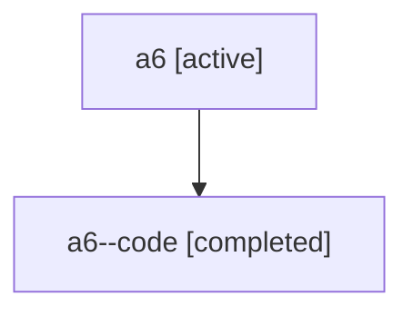

# Family: a6

Owner: `bbugyi200.athena` · Hood: `a6` · Members: 2

## Lineage

The diagram is an optional enhancement; the ordered table below contains the same lineage in accessible text.

| Role | Agent | State | Model / provider | Timing | Commits | Prompt | Chat |
|---|---|---|---|---|---:|---|---|
| root | a6 | active | claude-fable-5 / claude | 2026-07-16T11:46:11.485681+00:00 | 2 | [Prompt](../agents/bbugyi200.athena.a6/prompt.md) | [Chat](../agents/bbugyi200.athena.a6/chat.md) |
| code | a6--code | completed | gpt-5.6-sol / codex | 2026-07-16T11:50:45.229724+00:00 | 2 | — | [Chat](../agents/bbugyi200.athena.a6--code/chat.md) |
