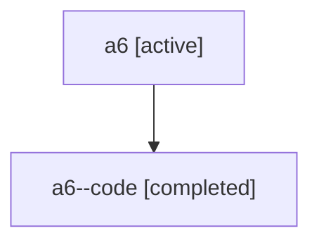

# Family: a6

[Agent Hoods](../README.md) / [bbugyi200](../users/bbugyi200/README.md) / [athena](../users/bbugyi200/machines/athena/README.md) / [a6](../users/bbugyi200/machines/athena/hoods/a6/README.md) / a6

Owner: `bbugyi200.athena` · Hood: `a6` · Members: 2

## Lineage

The diagram is an optional enhancement; the ordered table below contains the same lineage in accessible text.

| Role | Agent | State | Model / provider | Timing | Commits | Prompt | Chat |
|---|---|---|---|---|---:|---|---|
| root | a6 | active | claude-fable-5 / claude | 2026-07-16T11:46:11.485681+00:00 | [2](../agents/bbugyi200.athena.a6/README.md#commits) | [Prompt](../agents/bbugyi200.athena.a6/prompt.md) | [Chat](../agents/bbugyi200.athena.a6/chat.md) |
| code | a6--code | completed | gpt-5.6-sol / codex | 2026-07-16T11:50:45.229724+00:00 | 0 | — | [Chat](../agents/bbugyi200.athena.a6--code/chat.md) |

## Commits

| Role | Repo | Commit | Subject | Committed |
|---|---|---|---|---|
| root | sase | [`7432331`](https://github.com/sase-org/sase/commit/743233177c26e56948bc59ddab43550a1d615dbd) | docs: correct project glossary storage terminology | 2026-07-16 07:59:58 EDT |
| root | sase | [`bc68696`](https://github.com/sase-org/sase/commit/bc68696715826bdfef1817e22dc2c379f671362b) | chore: run sase init memory | 2026-07-16 08:01:53 EDT |
