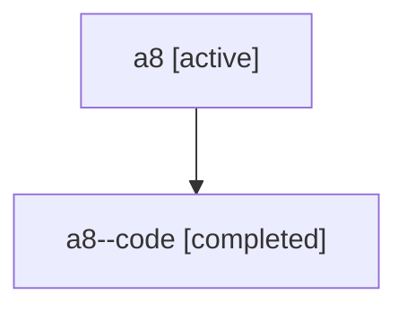

# Family: a8

[Agent Hoods](../README.md) / [bbugyi200](../users/bbugyi200/README.md) / [athena](../users/bbugyi200/machines/athena/README.md) / [a8](../users/bbugyi200/machines/athena/hoods/a8/README.md) / a8

Owner: `bbugyi200.athena` · Hood: `a8` · Members: 2

## Lineage

The diagram is an optional enhancement; the ordered table below contains the same lineage in accessible text.

| Role | Agent | State | Model / provider | Timing | Commits | Prompt | Chat |
|---|---|---|---|---|---:|---|---|
| root | a8 | active | gpt-5.6-sol / codex | 2026-07-16T12:02:19.113759+00:00 | [1](../agents/bbugyi200.athena.a8/README.md#commits) | [Prompt](../agents/bbugyi200.athena.a8/prompt.md) | [Chat](../agents/bbugyi200.athena.a8/chat.md) |
| code | a8--code | completed | gpt-5.6-sol / codex | 2026-07-16T12:09:50.004930+00:00 | 0 | — | [Chat](../agents/bbugyi200.athena.a8--code/chat.md) |

## Commits

| Role | Commit | Subject | Committed (UTC) |
|---|---|---|---|
| root | [`fac33c7`](https://github.com/sase-org/sase/commit/fac33c7a2f920b86d70ef05774ce4b699c9df7d3) | feat(tui): add on-demand prompt formatting | 2026-07-16 12:34:02 |

## Neighbors

| Agent | Relation | State |
|---|---|---|
| [a8.w0](../agents/bbugyi200.athena.a8.w0/README.md) | descendant | active |
