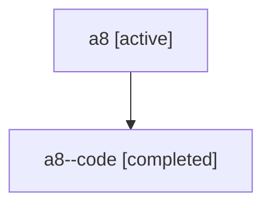

# Family: a8

Owner: `bbugyi200.athena` · Hood: `a8` · Members: 2

## Lineage

The diagram is an optional enhancement; the ordered table below contains the same lineage in accessible text.

| Role | Agent | State | Model / provider | Timing | Commits | Prompt | Chat |
|---|---|---|---|---|---:|---|---|
| root | a8 | active | gpt-5.6-sol / codex | 2026-07-16T12:02:19.113759+00:00 | 1 | [Prompt](../agents/bbugyi200.athena.a8/prompt.md) | [Chat](../agents/bbugyi200.athena.a8/chat.md) |
| code | a8--code | completed | gpt-5.6-sol / codex | 2026-07-16T12:09:50.004930+00:00 | 0 | — | [Chat](../agents/bbugyi200.athena.a8--code/chat.md) |
