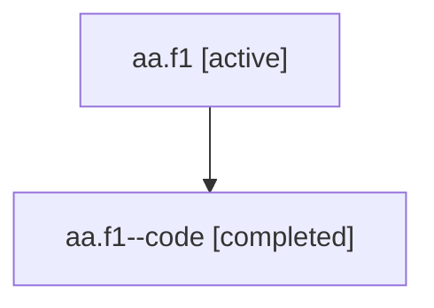

# Family: aa.f1

Owner: `bbugyi200.athena` · Hood: `aa` · Members: 2

## Lineage

The diagram is an optional enhancement; the ordered table below contains the same lineage in accessible text.

| Role | Agent | State | Model / provider | Timing | Commits | Prompt | Chat |
|---|---|---|---|---|---:|---|---|
| root | aa.f1 | active | gpt-5.6-sol / codex | 2026-07-16T13:42:57.084339+00:00 | 1 | [Prompt](../agents/bbugyi200.athena.aa.f1/prompt.md) | [Chat](../agents/bbugyi200.athena.aa.f1/chat.md) |
| code | aa.f1--code | completed | gpt-5.6-sol / codex | 2026-07-16T13:47:19.140405+00:00 | 1 | — | [Chat](../agents/bbugyi200.athena.aa.f1--code/chat.md) |
