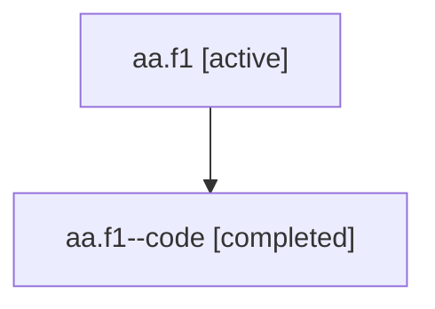

# Family: aa.f1

[Agent Hoods](../README.md) / [bbugyi200](../users/bbugyi200/README.md) / [athena](../users/bbugyi200/machines/athena/README.md) / [aa](../users/bbugyi200/machines/athena/hoods/aa/README.md) / aa.f1

Owner: `bbugyi200.athena` · Hood: `aa` · Members: 2

## Lineage

The diagram is an optional enhancement; the ordered table below contains the same lineage in accessible text.

| Role | Agent | State | Model / provider | Timing | Commits | Prompt | Chat |
|---|---|---|---|---|---:|---|---|
| root | aa.f1 | active | gpt-5.6-sol / codex | 2026-07-16T13:42:57.084339+00:00 | 0 | [Prompt](../agents/bbugyi200.athena.aa.f1/prompt.md) | [Chat](../agents/bbugyi200.athena.aa.f1/chat.md) |
| code | aa.f1--code | completed | gpt-5.6-sol / codex | 2026-07-16T13:47:19.140405+00:00 | [1](../agents/bbugyi200.athena.aa.f1--code/README.md#commits) | — | [Chat](../agents/bbugyi200.athena.aa.f1--code/chat.md) |

## Commits

| Role | Repo | Commit | Subject | Committed |
|---|---|---|---|---|
| code | sase | [`147090d`](https://github.com/sase-org/sase/commit/147090de1a6cbac42d11c2efa30dbd321c85fa81) | feat(ace): make update check interval configurable | 2026-07-16 14:02:09 UTC |

## Neighbors

| Agent | Relation | State |
|---|---|---|
| [aa](bbugyi200.athena.aa.md) (family · 2) | ancestor | active 1, completed 1 |
| [aa.f0](../agents/bbugyi200.athena.aa.f0/README.md) | aa hood | waiting |
