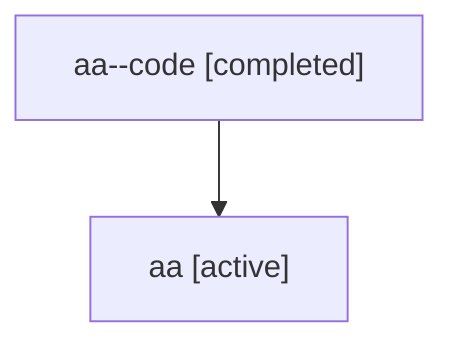

# Family: aa

Owner: `bbugyi200.athena` · Hood: `aa` · Members: 2

## Lineage

The diagram is an optional enhancement; the ordered table below contains the same lineage in accessible text.

| Role | Agent | State | Model / provider | Timing | Commits | Prompt | Chat |
|---|---|---|---|---|---:|---|---|
| code | aa--code | completed | gpt-5.6-sol / codex | 2026-07-16T13:29:19.190522+00:00 | 1 | — | [Chat](../agents/bbugyi200.athena.aa--code/chat.md) |
| root | aa | active | gpt-5.6-sol / codex | 2026-07-16T13:23:50.569732+00:00 | 1 | [Prompt](../agents/bbugyi200.athena.aa/prompt.md) | [Chat](../agents/bbugyi200.athena.aa/chat.md) |
