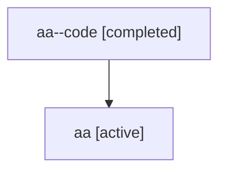

# Family: aa

[Agent Hoods](../README.md) / [bbugyi200](../users/bbugyi200/README.md) / [athena](../users/bbugyi200/machines/athena/README.md) / [aa](../users/bbugyi200/machines/athena/hoods/aa/README.md) / aa

Owner: `bbugyi200.athena` · Hood: `aa` · Members: 2

## Lineage

The diagram is an optional enhancement; the ordered table below contains the same lineage in accessible text.

| Role | Agent | State | Model / provider | Timing | Commits | Prompt | Chat |
|---|---|---|---|---|---:|---|---|
| code | aa--code | completed | gpt-5.6-sol / codex | 2026-07-16T13:29:19.190522+00:00 | 0 | — | [Chat](../agents/bbugyi200.athena.aa--code/chat.md) |
| root | aa | active | gpt-5.6-sol / codex | 2026-07-16T13:23:50.569732+00:00 | [1](../agents/bbugyi200.athena.aa/README.md#commits) | [Prompt](../agents/bbugyi200.athena.aa/prompt.md) | [Chat](../agents/bbugyi200.athena.aa/chat.md) |

## Commits

| Role | Repo | Commit | Subject | Committed (UTC) |
|---|---|---|---|---|
| root | sase | [`138a600`](https://github.com/sase-org/sase/commit/138a600ac36a68141a8719c9c45fc9786f5945a2) | feat(ace): add periodic update checks | 2026-07-16 13:42:30 |

## Neighbors

| Agent | Relation | State |
|---|---|---|
| [aa.f0](../agents/bbugyi200.athena.aa.f0/README.md) | descendant | waiting |
| [aa.f1](bbugyi200.athena.aa.f1.md) (family · 2) | descendant | active 1, completed 1 |
