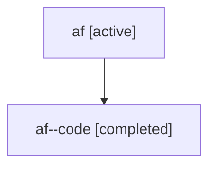

# Family: af

Owner: `bbugyi200.athena` · Hood: `af` · Members: 2

## Lineage

The diagram is an optional enhancement; the ordered table below contains the same lineage in accessible text.

| Role | Agent | State | Model / provider | Timing | Commits | Prompt | Chat |
|---|---|---|---|---|---:|---|---|
| root | af | active | gpt-5.6-sol / codex | 2026-07-16T14:53:53.784671+00:00 | 1 | [Prompt](../agents/bbugyi200.athena.af/prompt.md) | [Chat](../agents/bbugyi200.athena.af/chat.md) |
| code | af--code | completed | gpt-5.6-sol / codex | 2026-07-16T14:57:48.566607+00:00 | 1 | — | [Chat](../agents/bbugyi200.athena.af--code/chat.md) |
