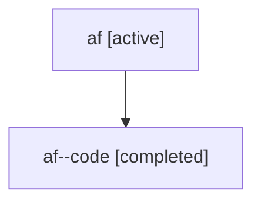

# Family: af

[Agent Hoods](../README.md) / [bbugyi200](../users/bbugyi200/README.md) / [athena](../users/bbugyi200/machines/athena/README.md) / [af](../users/bbugyi200/machines/athena/hoods/af/README.md) / af

Owner: `bbugyi200.athena` · Hood: `af` · Members: 2

## Lineage

The diagram is an optional enhancement; the ordered table below contains the same lineage in accessible text.

| Role | Agent | State | Model / provider | Timing | Commits | Prompt | Chat |
|---|---|---|---|---|---:|---|---|
| root | af | active | gpt-5.6-sol / codex | 2026-07-16T14:53:53.784671+00:00 | [1](../agents/bbugyi200.athena.af/README.md#commits) | [Prompt](../agents/bbugyi200.athena.af/prompt.md) | [Chat](../agents/bbugyi200.athena.af/chat.md) |
| code | af--code | completed | gpt-5.6-sol / codex | 2026-07-16T14:57:48.566607+00:00 | 0 | — | [Chat](../agents/bbugyi200.athena.af--code/chat.md) |

## Commits

| Role | Repo | Commit | Subject | Committed (UTC) |
|---|---|---|---|---|
| root | sase | [`c08a434`](https://github.com/sase-org/sase/commit/c08a43458d712f78f2008113044ffef2df6b47b3) | fix(ace): keep collapsed agent panels last | 2026-07-16 15:12:38 |
