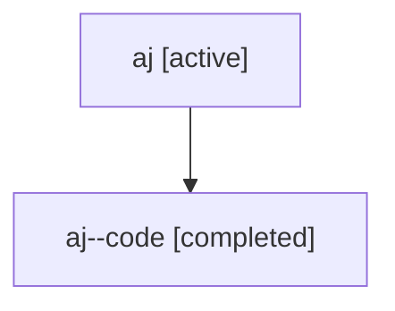

# Family: aj

Owner: `bbugyi200.athena` · Hood: `aj` · Members: 2

## Lineage

The diagram is an optional enhancement; the ordered table below contains the same lineage in accessible text.

| Role | Agent | State | Model / provider | Timing | Commits | Prompt | Chat |
|---|---|---|---|---|---:|---|---|
| root | aj | active | gpt-5.6-sol / codex | 2026-07-16T16:58:57.478479+00:00 | 1 | [Prompt](../agents/bbugyi200.athena.aj/prompt.md) | [Chat](../agents/bbugyi200.athena.aj/chat.md) |
| code | aj--code | completed | gpt-5.6-sol / codex | 2026-07-16T17:05:17.049000+00:00 | 1 | — | [Chat](../agents/bbugyi200.athena.aj--code/chat.md) |
