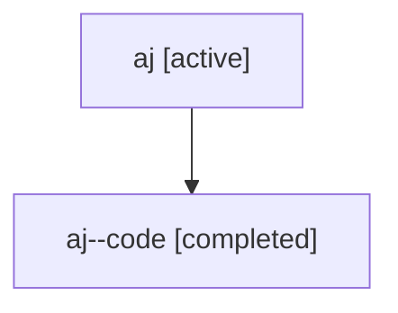

# Family: aj

[Agent Hoods](../README.md) / [bbugyi200](../users/bbugyi200/README.md) / [athena](../users/bbugyi200/machines/athena/README.md) / [aj](../users/bbugyi200/machines/athena/hoods/aj/README.md) / aj

Owner: `bbugyi200.athena` · Hood: `aj` · Members: 2

## Lineage

The diagram is an optional enhancement; the ordered table below contains the same lineage in accessible text.

| Role | Agent | State | Model / provider | Timing | Commits | Prompt | Chat |
|---|---|---|---|---|---:|---|---|
| root | aj | active | gpt-5.6-sol / codex | 2026-07-16T16:58:57.478479+00:00 | 0 | [Prompt](../agents/bbugyi200.athena.aj/prompt.md) | [Chat](../agents/bbugyi200.athena.aj/chat.md) |
| code | aj--code | completed | gpt-5.6-sol / codex | 2026-07-16T17:05:17.049000+00:00 | [1](../agents/bbugyi200.athena.aj--code/README.md#commits) | — | [Chat](../agents/bbugyi200.athena.aj--code/chat.md) |

## Commits

| Role | Repo | Commit | Subject | Committed |
|---|---|---|---|---|
| code | sase | [`8359294`](https://github.com/sase-org/sase/commit/835929471ffe7618503a3d3b5fa193206136a5ca) | feat(ace): add numbered artifacts and saved query picker | 2026-07-16 17:36:30 UTC |
