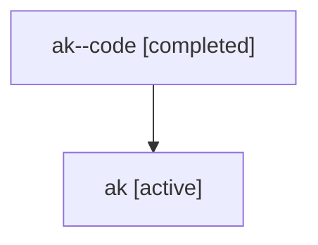

# Family: ak

[Agent Hoods](../README.md) / [bbugyi200](../users/bbugyi200/README.md) / [athena](../users/bbugyi200/machines/athena/README.md) / [ak](../users/bbugyi200/machines/athena/hoods/ak/README.md) / ak

Owner: `bbugyi200.athena` · Hood: `ak` · Members: 2

## Lineage

The diagram is an optional enhancement; the ordered table below contains the same lineage in accessible text.

| Role | Agent | State | Model / provider | Timing | Commits | Prompt | Chat |
|---|---|---|---|---|---:|---|---|
| code | ak--code | completed | gpt-5.6-sol / codex | 2026-07-16T17:21:01.646485+00:00 | [1](../agents/bbugyi200.athena.ak--code/README.md#commits) | — | [Chat](../agents/bbugyi200.athena.ak--code/chat.md) |
| root | ak | active | claude-fable-5 / claude | 2026-07-16T17:01:36.861772+00:00 | 0 | [Prompt](../agents/bbugyi200.athena.ak/prompt.md) | [Chat](../agents/bbugyi200.athena.ak/chat.md) |

## Commits

| Role | Repo | Commit | Subject | Committed |
|---|---|---|---|---|
| code | sase | [`592c252`](https://github.com/sase-org/sase/commit/592c252a3e45ff626cc98505e3b4d42dfa49f98b) | test: stabilize cross-version CI checks | 2026-07-16 13:44:11 EDT |
