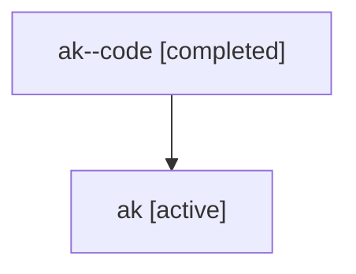

# Family: ak

Owner: `bbugyi200.athena` · Hood: `ak` · Members: 2

## Lineage

The diagram is an optional enhancement; the ordered table below contains the same lineage in accessible text.

| Role | Agent | State | Model / provider | Timing | Commits | Prompt | Chat |
|---|---|---|---|---|---:|---|---|
| code | ak--code | completed | gpt-5.6-sol / codex | 2026-07-16T17:21:01.646485+00:00 | 1 | — | [Chat](../agents/bbugyi200.athena.ak--code/chat.md) |
| root | ak | active | claude-fable-5 / claude | 2026-07-16T17:01:36.861772+00:00 | 1 | [Prompt](../agents/bbugyi200.athena.ak/prompt.md) | [Chat](../agents/bbugyi200.athena.ak/chat.md) |
