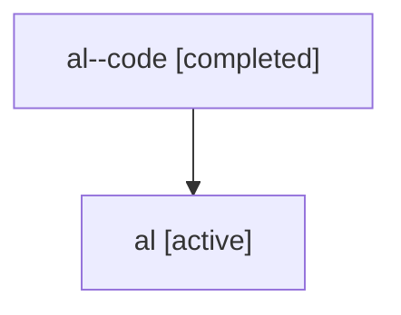

# Family: al

[Agent Hoods](../README.md) / [bbugyi200](../users/bbugyi200/README.md) / [athena](../users/bbugyi200/machines/athena/README.md) / [al](../users/bbugyi200/machines/athena/hoods/al/README.md) / al

Owner: `bbugyi200.athena` · Hood: `al` · Members: 2

## Lineage

The diagram is an optional enhancement; the ordered table below contains the same lineage in accessible text.

| Role | Agent | State | Model / provider | Timing | Commits | Prompt | Chat |
|---|---|---|---|---|---:|---|---|
| code | al--code | completed | gpt-5.6-sol / codex | 2026-07-16T17:21:59.447090+00:00 | [1](../agents/bbugyi200.athena.al--code/README.md#commits) | — | [Chat](../agents/bbugyi200.athena.al--code/chat.md) |
| root | al | active | claude-fable-5 / claude | 2026-07-16T17:04:20.342312+00:00 | [1](../agents/bbugyi200.athena.al/README.md#commits) | [Prompt](../agents/bbugyi200.athena.al/prompt.md) | [Chat](../agents/bbugyi200.athena.al/chat.md) |

## Commits

| Role | Repo | Commit | Subject | Committed |
|---|---|---|---|---|
| code | sase | [`6a4a47f`](https://github.com/sase-org/sase/commit/6a4a47f94322474395c3d7b80f42fe6c9e0136de) | docs: refresh TUI performance guidance | 2026-07-16 13:38:57 EDT |
| root | sase | [`6a4a47f`](https://github.com/sase-org/sase/commit/6a4a47f94322474395c3d7b80f42fe6c9e0136de) | docs: refresh TUI performance guidance | 2026-07-16 13:38:57 EDT |
