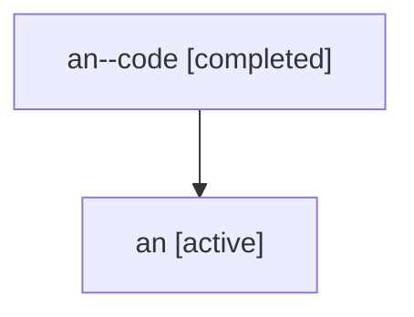

# Family: an

[Agent Hoods](../README.md) / [bbugyi200](../users/bbugyi200/README.md) / [athena](../users/bbugyi200/machines/athena/README.md) / [an](../users/bbugyi200/machines/athena/hoods/an/README.md) / an

Owner: `bbugyi200.athena` · Hood: `an` · Members: 2

## Lineage

The diagram is an optional enhancement; the ordered table below contains the same lineage in accessible text.

| Role | Agent | State | Model / provider | Timing | Commits | Prompt | Chat |
|---|---|---|---|---|---:|---|---|
| code | an--code | completed | gpt-5.6-sol / codex | 2026-07-16T17:29:54.424518+00:00 | [1](../agents/bbugyi200.athena.an--code/README.md#commits) | — | [Chat](../agents/bbugyi200.athena.an--code/chat.md) |
| root | an | active | gpt-5.6-sol / codex | 2026-07-16T17:20:21.784866+00:00 | 0 | [Prompt](../agents/bbugyi200.athena.an/prompt.md) | [Chat](../agents/bbugyi200.athena.an/chat.md) |

## Commits

| Role | Repo | Commit | Subject | Committed |
|---|---|---|---|---|
| code | sase | [`69d7142`](https://github.com/sase-org/sase/commit/69d7142b45cecdf43ded7aef7e976df2d816d900) | feat: link plan tags in commit footers | 2026-07-16 13:57:43 EDT |
