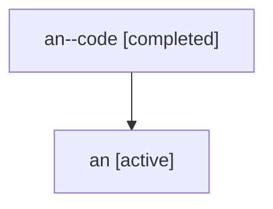

# Family: an

Owner: `bbugyi200.athena` · Hood: `an` · Members: 2

## Lineage

The diagram is an optional enhancement; the ordered table below contains the same lineage in accessible text.

| Role | Agent | State | Model / provider | Timing | Commits | Prompt | Chat |
|---|---|---|---|---|---:|---|---|
| code | an--code | completed | gpt-5.6-sol / codex | 2026-07-16T17:29:54.424518+00:00 | 1 | — | [Chat](../agents/bbugyi200.athena.an--code/chat.md) |
| root | an | active | gpt-5.6-sol / codex | 2026-07-16T17:20:21.784866+00:00 | 1 | [Prompt](../agents/bbugyi200.athena.an/prompt.md) | [Chat](../agents/bbugyi200.athena.an/chat.md) |
