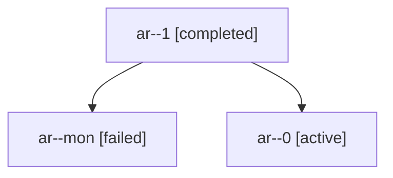

# Family: ar

[Agent Hoods](../README.md) / [bbugyi200](../users/bbugyi200/README.md) / [athena](../users/bbugyi200/machines/athena/README.md) / [ar](../users/bbugyi200/machines/athena/hoods/ar/README.md) / ar

Owner: `bbugyi200.athena` · Hood: `ar` · Members: 3

## Lineage

The diagram is an optional enhancement; the ordered table below contains the same lineage in accessible text.

| Role | Agent | State | Model / provider | Timing | Commits | Prompt | Chat |
|---|---|---|---|---|---:|---|---|
| 1 | ar--1 | completed | sonnet / claude | 2026-09-13T21:51:26.053334+00:00 → 2026-09-13T21:59:02.326473+00:00 | [1](../agents/bbugyi200.athena.ar--1/README.md#commits) | [Prompt](../agents/bbugyi200.athena.ar--1/prompt.md) | [Chat](../agents/bbugyi200.athena.ar--1/chat.md) |
| mon | ar--mon | failed | sonnet / claude | 2026-09-13T21:36:10.111161+00:00 → 2026-09-13T21:44:30.260850+00:00 | 0 | — | [Chat](../agents/bbugyi200.athena.ar--mon/chat.md) |
| 0 | ar--0 | active | sonnet / claude | 2026-09-13T21:24:47.582047+00:00 | 0 | [Prompt](../agents/bbugyi200.athena.ar--0/prompt.md) | [Chat](../agents/bbugyi200.athena.ar--0/chat.md) |

## Commits

| Role | Repo | Commit | Subject | Committed |
|---|---|---|---|---|
| 1 | sase | [`52c80c9`](https://github.com/sase-org/sase/commit/52c80c9528020841304775584757d7b6d73d034e) | fix(retention): degrade to continuation\_unavailable instead of crashing when continuation retention planning fails | 2026-09-13 17:54:18 EDT |
